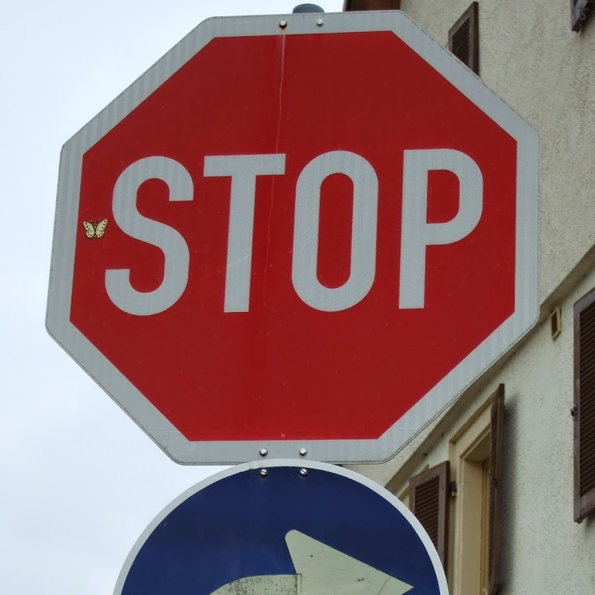
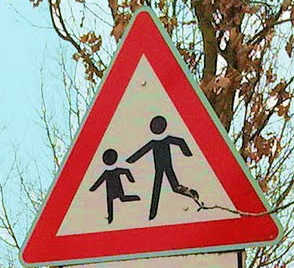

# **Traffic Sign Recognition** 

[//]: # (Image References)

[image1]: ./images_for_write_up/data_distribution.png "Visualization"

## Data Set Summary & Exploration

This project's data is [German Traffic Data Set](http://benchmark.ini.rub.de/?section=gtsrb&subsection=dataset) for creating model.

* The size of training set is 34799.
* The size of test set is 12630.
* The shape of a traffic sign image is (32, 32, 3)
* The number of unique classes/labels in the data set is 43

Here is an exploratory visualization of the data set. It is a bar chart showing how the data is distributed.

![alt text][image1]

## Design and Test a Model Architecture

### Preprocessed the Image Data

#### Grayscale

I converted traning images from RGB to grayscale image for cutting calculate cost and creating model by luminance not colar.

### Nomalization

I normalized traning images for stretching contrast.

### Model Architecture

My final model consisted of the following layers:

| Layer         		|     Description	        					| 
|:---------------------:|:---------------------------------------------:| 
| Input         		| 32x32x1 RGB image   							| 
| Convolution 5x5     	| 1x1 stride, same padding, outputs 28x28x6 	|
| RELU					| for activation |
| Max pooling	2x2      	| 2x2 stride,  outputs 14x14x6 				|
| Convolution 5x5     	| 1x1 stride, same padding, outputs 10x10x16 	|
| RELU					| for activation |
| Max pooling	2x2      	| 2x2 stride,  outputs 5x5x16 				|
| Flatten	    | inputs 400, outputs 120      									|
| Fully connected		| inputs 120, outputs 84        									|
| RELU					| for activation |
| Fully connected		| inputs 120, outputs 84        									|
| RELU					| for activation |
| Fully connected		| inputs 84, outputs 43        									|
| Softmax				| for classification         									|


* Convolution layer's output is calcuated by W -2[H/2] * W -2[H/2]. ([・] is round down.) When input data is 32x32 and filter is 5x5, output data is 28x28. 
* RELU means rectified linear unit. f(u) = max(u, 0)
* Softmax layer decides output by each inputs not sum of inputs.

### How To Train My Model

| Optimizer         		|     Batch Size	        					| Number of epochs | Learning rate |
|:---------------------:|:---------------------------------------------:|:-----------:|:------------:|
| [Adam Optimizer](https://arxiv.org/pdf/1412.6980.pdf)       		| 100   							| 60 | 0.0009 |

My final model results were:
* training set accuracy of 0.930
* validation set accuracy of 0.930
* test set accuracy of 0.915

## Test a Model on New Images

### How to Test Model

Here are five German traffic signs that I found on the web:

    
  

The second image might be difficult to classify because it includes two signs which are `stop` and `Keep Right`.


### Test Discussion

Here are the results of the prediction:

| Image			        |     Prediction	        					| 
|:---------------------:|:---------------------------------------------:| 
| Yield      		| Yield   									| 
| Stop     			| Keep right 										|
| Slippery road					| Slippery road											|
| Road work	      		| Road work					 				|
| Children crossing			| Children crossing      							|
| No entry			| No entry      							|


The model was able to correctly guess 5 of the 6 traffic signs, which gives an accuracy of 83%. This compares favorably to the accuracy on the test set, the accuracy on the test set is better than one of new traffic signs from website. I think this fact comes from number of images. The accuracy of new traffic signs from website will be better if number of them increases.

### Softmax Probabilities

 

|:---------------------:|:---------------------------------------------:| 
| Probability         	|     Prediction	        					| 
| 100.00%         			| Yield   									| 


| Probability         	|     Prediction	        					| 
|:---------------------:|:---------------------------------------------:| 
| 95.83%         			| Keep right   									| 
| 4.14%         			| End of no passing by vehicles over 3.5 metric tons   									| 
| 0.03%         			| Turn left ahead   									| 
| 0.01%         			| No passing for vehicles over 3.5 metric tons   									| 


|:---------------------:|:---------------------------------------------:| 
| Probability         	|     Prediction	        					| 
| 100.00%         			| Slippery road   									| 


|:---------------------:|:---------------------------------------------:| 
| Probability         	|     Prediction	        					| 
| 98.95%         			| Road work   									| 
| 1.00%         			| Slippery road   									| 
| 0.05%         			| No passing for vehicles over 3.5 metric tons   									| 


|:---------------------:|:---------------------------------------------:| 
| Probability         	|     Prediction	        					| 
| 99.93%         			| Children crossing   									| 
| 0.07%        			| Road narrows on the right   									| 


|:---------------------:|:---------------------------------------------:| 
| Probability         	|     Prediction	        					| 
| 100.00%         			| No entry   									| 


## TODO
* (Optional) Visualizing the Neural Network (See Step 4 of the Ipython notebook for more details)

## Others
* If you use `Traffic_Sign_Classifier.ipynb` at your local environment, you should do this command after install `jupyter notebook` because default `iopub_data_rate_limit` is too low to create model.

```
jupyter notebook --NotebookApp.iopub_data_rate_limit=10000000000
```
